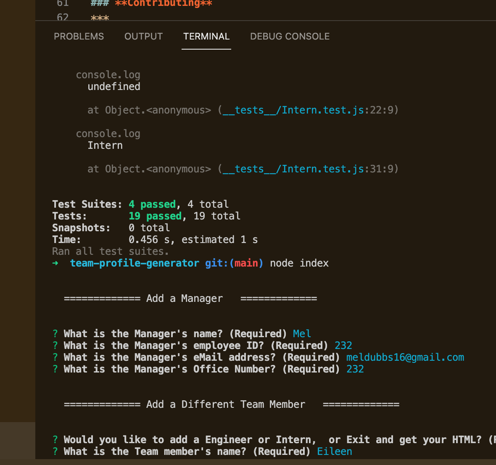
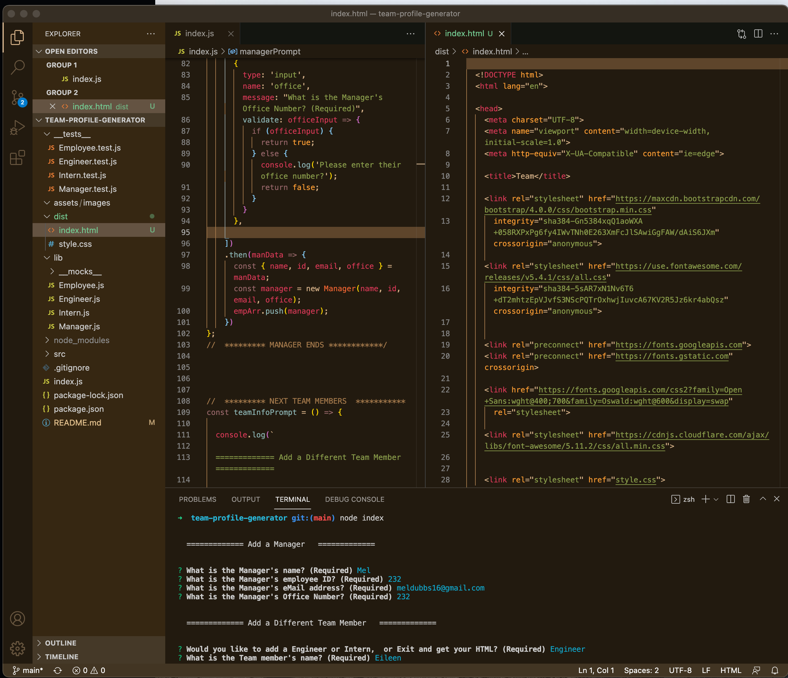
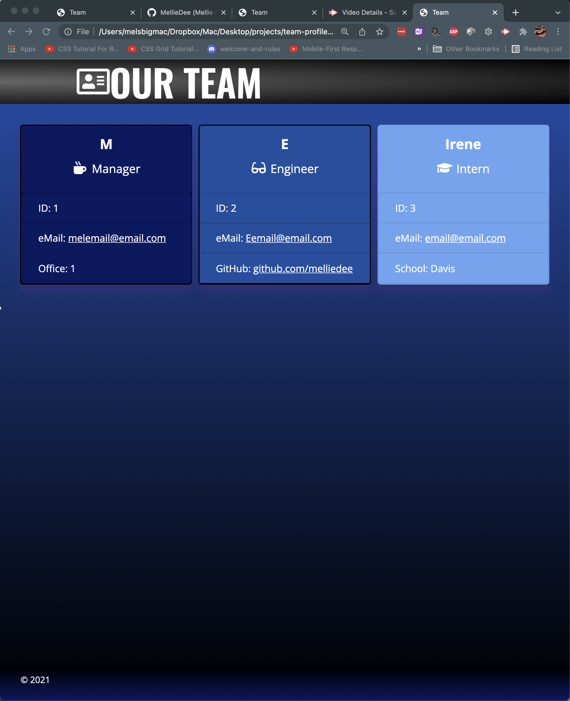
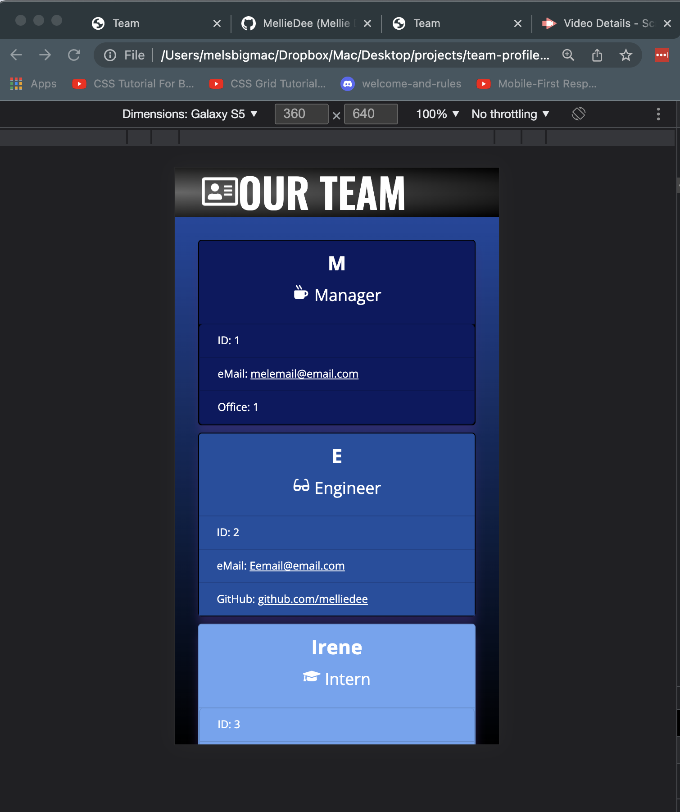

# **Team Profile Generator**
&nbsp;

&nbsp;

## **Project Description**
***
This command line app quickly generates an HTML file which when opened in a browser displays a simple, but informative Company Team Profile Page. Upon start of the app, the user answers questions from the Inquirer commandline prompts. Each answer is collected, processed then applied to the appropriate line in a HTML file. Team Profile Generator frees up time for busy managers or HR departments and ensures basic employee data is easily recorded and managed. 

&nbsp;

## Table of Contents
***
* [Installation](#installation)
* [Usage](#usage)
* [URL](#url)
* [Screenshot](#screenshot)
* [Contributing](#contributing)
* [Tests](#tests)
* [Resources](#resources)
* [Questions](#questions)
* [License](#license)

&nbsp;

## **Installation**
***
Ensure you have Node installed. Fork the repo. Clone to local directory. Install npm package: from command line, in the main program directory, type: npm install. Program runs from the index.js file: from command line, in the main program directory, type: node index. (Also uses inquirer, node fs and jest dependencies which are called in the code. If don't already have Jest, will need to add that, too.)

&nbsp;

## **Usage**
***
Answer the questions when prompted. Hints: Do not start any answer with the space bar (Profile will generate, but not correctly formatted.) Your HTML file will appear in the dist directory.

&nbsp;

## **URL**
***
Does not have a deployment URL.
[Team Profile Generator run through on  YouTube](https://youtu.be/fbokePciccE)

&nbsp;

&nbsp;

## **Screenshot**
***

&nbsp;

&nbsp;

&nbsp;

&nbsp;

### **Contributing**
***
Not accepting contributors.

&nbsp;

### **Tests**
***
See the tests file for test used to create the app. nothing more than that at this time.

&nbsp;

### **Resources**
***

#### Styling
https://hookagency.com/blog/website-color-schemes/

https://css-tricks.com/radial-gradient-recipes/

https://developers.google.com/fonts/docs/material_icons apache

https://www.geeksforgeeks.org/how-to-place-two-bootstrap-cards-next-to-each-other/

Styles I researched and made a swipe of: Team-Profile-Style-Swipe image in assets

#### Coding
https://attacomsian.com/blog/javascript-iterate-objects

https://attacomsian.com/blog/javascript-iterate-array-of-objects

https://github.com/nicolewallace09/team-profile-generator/blob/master/src/generateHTML.js

&nbsp;

### **Questions**
***
Reach me directly at  mongaybay00@outlook.com    
Or checkout out my GitHub profile:  [github.com/MellieDee](https://github.com/MellieDee)

&nbsp;

### **License**
***
Copyright (c) Melanie. 

Licensed under the [MIT](https://choosealicense.com/licenses) license.
    
&nbsp;
      
 

##### Return to:
***
* [Installation](#installation)
* [Usage](#usage)
* [URL](#url)
* [Screenshot](#screenshot)
* [Contributing](#contributing)
* [Tests](#tests)
* [Resources](#resources)
* [Questions](#questions)
* [License](#license)

&nbsp;

